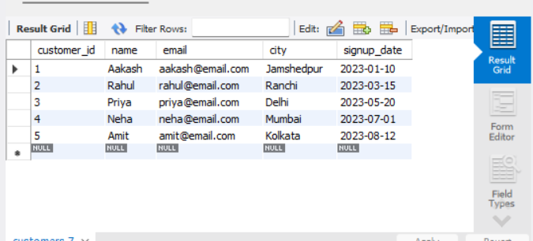
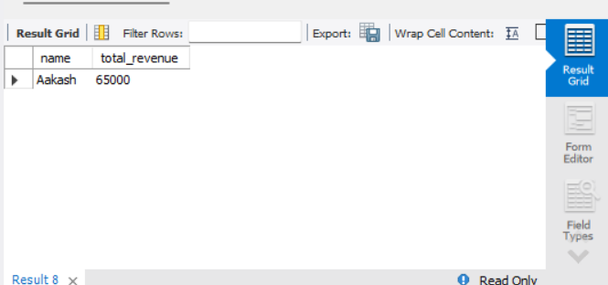
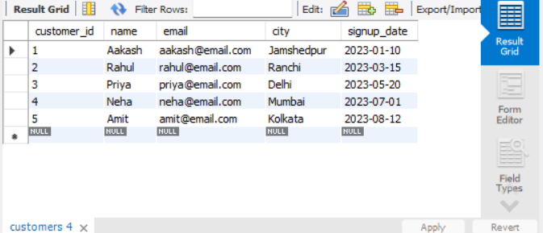

# 🛒 E-commerce Analytics SQL Project

## 📌 Overview

This project demonstrates SQL-based data analysis on an e-commerce dataset. It includes database design, data processing, and business insights using MySQL.

---

## 🛠️ Tech Stack

* MySQL
* SQL (Joins, Aggregations, Window Functions, Stored Procedures)

---

## 📂 Project Structure

```
ecommerce-analytics-sql/
│
├── sql/
│   └── ecommerce.sql
│
├── screenshots/
│   ├── customers.png
│   ├── orders.png
│   ├── total_revenue.png
│   ├── procedure_output.png
│
└── README.md
```

---

## 🚀 Key Features

### 1. Database Design

* Created normalized tables: Customers, Products, Orders
* Applied constraints (Primary Key, Foreign Key, Unique)

### 2. Revenue Analysis

* Calculated total revenue from delivered orders

### 3. Customer Insights

* Identified high-value customers
* Analyzed customer purchase behavior

### 4. SQL Concepts Used

* JOIN operations
* GROUP BY & Aggregations
* Stored Procedures
* Indexing

---

## 📊 Sample Outputs

### Customers Table



### Orders Table


### Total Revenue



### Stored Procedure Output



---

## 🧠 Business Insights

* Helps identify top customers
* Tracks revenue performance
* Useful for decision-making in e-commerce platforms

---

## ▶️ How to Run

1. Open MySQL Workbench
2. Open `sql/ecommerce.sql`
3. Execute the script

---

## 👨‍💻 Author

**Aakash Kumar Yadav**
